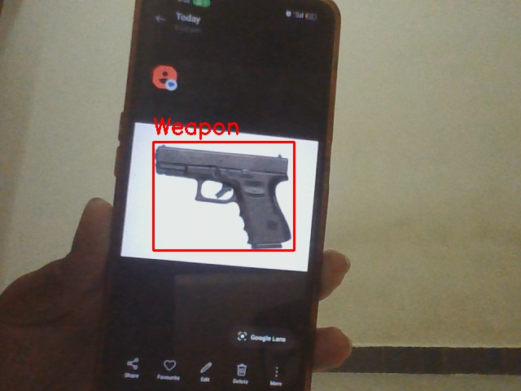
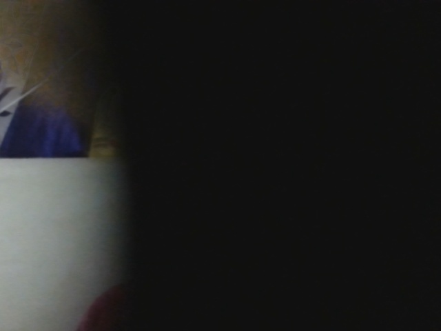

# AI-Driven Video Surveillance System with Anomaly Detection

An AI-based video surveillance system that monitors live camera feeds for potential security incidents, including weapon detection and camera obstruction.

The system combines **YOLO-based object detection** with **OpenCV-based image analysis** to identify suspicious events and automatically generate alerts and incident snapshots.

---

## 🚀 Features

- Real-time video surveillance using OpenCV
- YOLO-based weapon detection
- Full camera blockage detection
- Partial camera blockage detection
- Automatic incident snapshot capture
- Email alerts with incident snapshots
- SMS alerts using Twilio
- Event cooldown mechanism to reduce repeated alerts
- Timestamped event logging
- Multi-camera support using Python threading

---

## 🛠️ Technologies Used

| Technology | Purpose |
|---|---|
| Python | Core application development |
| OpenCV | Video processing and image analysis |
| YOLO / Ultralytics | Weapon detection |
| NumPy | Numerical and image-based calculations |
| Python-dotenv | Environment variable management |
| SMTP | Email notifications |
| Twilio | SMS notifications |
| Python Threading | Multi-camera processing |

---

## 🔍 How It Works

The system continuously captures frames from connected camera sources and performs multiple security checks.

### 1. 🔫 Weapon Detection

A custom-trained YOLO model is used to detect weapons in the camera feed.

When a weapon is detected:

1. The detected object is highlighted.
2. An incident snapshot is captured.
3. An email alert is triggered.
4. An SMS alert is triggered.
5. A cooldown mechanism prevents repeated alerts from being sent continuously.

### 2. 🚫 Full Camera Blockage Detection

The system analyzes the average brightness of the camera frame.

If the brightness remains below a predefined threshold for the configured duration, the system identifies the camera as fully blocked.

An incident snapshot is captured and alerts are triggered.

### 3. ⚠️ Partial Camera Blockage Detection

The system calculates the ratio of dark pixels within the frame.

If a sufficiently large portion of the frame remains dark for the configured detection period, the system identifies a partial camera blockage.

An incident snapshot is captured and alerts are triggered.

---

## 📸 Detection Results

### 🔫 Weapon Detection

Example output from the weapon detection module:



---

### 🚫 Full Camera Blockage

Example output from the full camera blockage detection module:


---

### ⚠️ Partial Camera Blockage

Example output from the partial camera blockage detection module:



---

## 📁 Project Structure

```text
AI-Video-Surveillance-Anomaly-Detection/
│
├── snapshots/
│   ├── fully_blocked/
│   ├── partially_blocked/
│   └── weapon/
│
├── detection.py
├── VideoSurveillanceSystem.py
├── weapon_detect.pt
├── requirements.txt
├── .gitignore
└── README.md